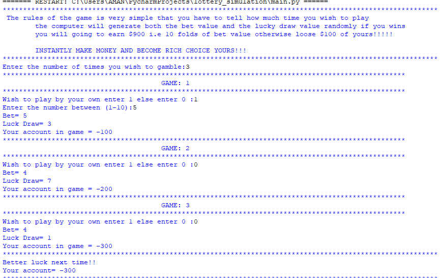

# lottery_simulation game:
--------------------------------------------------------

Hope that if someone who wish to contribute can help me with it. :heart_eyes:
The help from you will be appreciated.  :thumbsup:

## The game when run look like :smiley:
---------------------------------------

### This is the firstway to add image to README.md
-----------------------------------------------------

### This is the second way to add image to README.md
-------------------------------------------------------

